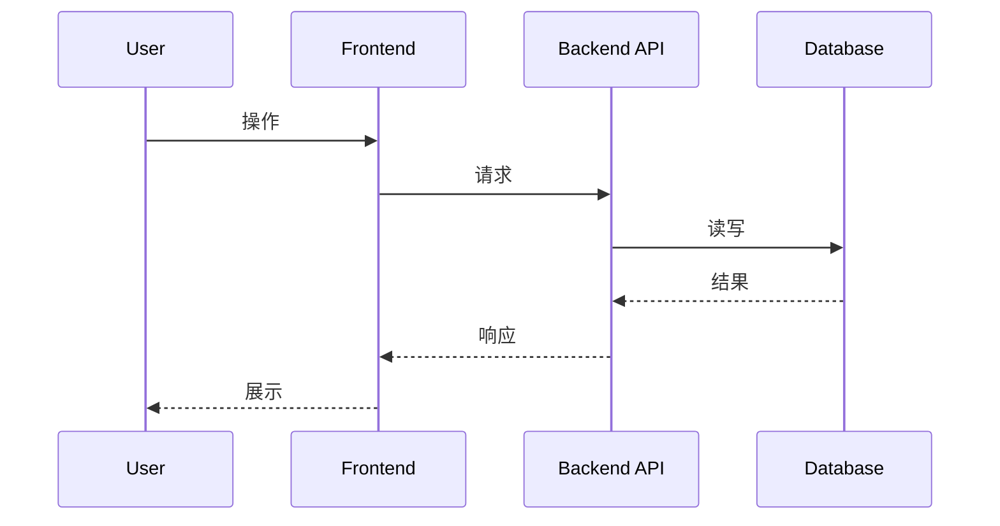

# [项目名称] 技术方案设计（版本文档模板）

> 说明：本文件用于 `docs/<版本号>/design.md`，聚焦本次迭代的“要改什么、怎么改、怎么验证、怎么上线与回滚”。  
> 系统当前全景与长期决策请维护在 `docs/技术方案设计.md`（模板：`.aicoding/templates/master_design_template.md`）。

## 文档信息
| 项 | 值 |
|---|---|
| 状态 | Draft / Review / Approved |
| 作者 |  |
| 评审 |  |
| 日期 | YYYY-MM-DD |
| 版本号 | `<版本号>`（与目录一致，如 `v1.0`） |
| 关联提案 | `docs/<版本号>/proposal.md`（如有） |
| 关联需求 | `docs/<版本号>/requirements.md` |
| 关联主文档 | `docs/技术方案设计.md` |
| 关联接口 | `docs/接口文档.md` / OpenAPI（如有） |

---

## 0. 摘要（Executive Summary）
用 10~20 行说明：
- 背景与痛点（为什么要做）
- 本次交付物（用户可感知变化）
- 关键技术路线（高层架构变化）
- 风险与边界（不做什么、已知风险、需要决策的点）

## 0.5 决策记录（Design 前置收集结果）

> 本章节由 AI 在 Design 阶段开始时自动生成，记录用户对技术决策和环境配置的确认结果。
> 后续设计内容基于这些决策展开，如需变更请走 CR 流程。

### 技术决策
| 编号 | 决策项 | 用户选择 | 理由/备注 |
|------|--------|---------|----------|
| D-01 | 后端语言/框架 |  |  |
| D-02 | 数据库 |  |  |
| D-03 | 部署形态 |  |  |
| ... | ... |  |  |

### 环境配置
| 配置项 | 开发环境 | 生产环境 | 敏感 | 备注 |
|--------|---------|---------|------|------|
| 服务器/云平台 |  |  | 否 |  |
| 域名 |  |  | 否 |  |
| 数据库地址 |  |  | 是 | 见 .env |
| 数据库端口 |  |  | 否 |  |
| 数据库名 |  |  | 否 |  |
| 数据库账号 |  |  | 是 | 见 .env |
| 缓存地址 |  |  | 是 | 见 .env |
| ... |  |  |  |  |

> **敏感项**：标记为"敏感=是"的配置项，实际值写入 `.env`（不进 git），本表只记录变量名。
> **留空项**：标记为"待部署阶段确认"，Deployment 阶段 AI 会提醒补填。

## 1. 背景、目标、非目标与约束

### 1.1 背景与问题
- 现状与痛点：
- 触发原因（缺陷/性能/合规/业务增长/成本）：
- 相关历史（可链接到 PR/Issue/事故复盘）：

### 1.2 目标（Goals，可验收）
- G1 与 `REQ-xxx` 对齐的目标（必须可验证、可度量）
- G2 ...

### 1.3 非目标（Non-Goals，防范围漂移）
- N1 本次明确不做什么（以及为什么）
- N2 ...

### 1.4 关键约束（Constraints）
- C1 时间/资源（人力、交付窗口）：
- C2 兼容性（不得破坏现有 API/数据/行为）：
- C3 合规与安全（如：审计留痕、隐私、数据出境）：
- C4 依赖系统能力与 SLA（如：下游限流、异步一致性）：

### 1.5 关键假设（Assumptions）
| 假设 | 可验证方式 | 失效影响 | 兜底策略 |
|---|---|---|---|
|  |  |  |  |

## 2. 需求对齐与验收口径（Traceability）

### 2.1 需求-设计追溯矩阵（必须）
<!-- TRACE-MATRIX-BEGIN -->
| REQ-ID | 需求摘要 | 设计落点（章节/模块/API/表） | 验收方式/证据 |
|---|---|---|---|
| REQ-001 |  | 第 4 章 / API-001 | 测试用例/压测报告/截图 |
<!-- TRACE-MATRIX-END -->

### 2.2 质量属性与典型场景（Quality Scenarios，推荐）
按“触发条件 → 系统行为 → 可度量结果”描述，便于做验收与压测/演练。
| Q-ID | 质量属性 | 场景描述 | 目标/阈值 | 验证方式 |
|---|---|---|---|---|
| Q-01 | 可用性 | 下游超时 | P95 < 200ms；错误率<0.1% | 故障注入/压测 |

## 3. 现状分析与方案选型（Options & Trade-offs）

### 3.1 现状与问题定位
- 现状架构与关键路径（可贴图/时序）：
- 问题根因（数据/并发/依赖/流程/权限）：
- 约束与不可改动点：

### 3.2 方案候选与对比（至少 2 个）
| 方案 | 核心思路 | 优点 | 缺点/风险 | 成本 | 结论 |
|---|---|---|---|---|---|
| A |  |  |  | 人天/资源 | 采用/不采用 |
| B |  |  |  |  |  |

### 3.3 关键技术选型与新增依赖评估
> 新增依赖需“必要性 + 替代方案 + 维护/安全评估 + 移除成本”。

| 组件/依赖 | 选型 | 理由 | 替代方案 | 维护状态 | 安全评估 | 移除/替换成本 | 风险/备注 |
|---|---|---|---|---|---|---|---|
|  |  |  |  | 活跃/停滞 |  |  |  |

**维护状态说明**：活跃（近 6 个月有更新）、停滞（超过 1 年无更新）  
**安全评估说明**：已知漏洞、供应链风险、社区口碑、许可证合规

## 4. 总体设计（High-level Design）

### 4.1 系统上下文与边界
- 系统边界：输入/输出、责任边界、数据边界
- 外部依赖：系统/服务/队列/第三方（含 SLA/失败模式/降级）

外部依赖清单：
| 依赖方/系统 | 用途 | 协议 | SLA/SLO | 失败模式 | 降级/兜底 | Owner |
|---|---|---|---|---|---|---|
|  |  |  |  |  |  |  |

### 4.2 架构概述（建议按 C4）
- Context/Container/Component 图（可用 Mermaid/图片）
- 模块划分与职责边界（谁负责什么）
- 数据流（Data Flow）与信任边界（Trust Boundary）

（示例：Mermaid 时序图占位）

### 4.3 变更影响面（Impact Analysis）
| 影响面 | 是否影响 | 说明 | 需要迁移/兼容 | Owner |
|---|---|---|---|---|
| API 契约 | 是/否 |  | 版本/兼容策略 |  |
| 数据库/存储 | 是/否 |  | 迁移/回滚 |  |
| 权限与审计 | 是/否 |  |  |  |
| 性能与容量 | 是/否 |  | 压测/基线 |  |
| 运维与监控 | 是/否 |  | 告警/看板 |  |
| 前端/交互 | 是/否 |  |  |  |

## 5. 详细设计（Low-level Design）

### 5.1 模块分解与职责（Components）
按模块列出：
- 职责边界、输入输出、关键依赖
- 关键接口（建议编号 `API-xxx` / `EVT-xxx`）
- 关键数据结构（DTO/VO/Schema）

模块清单（示例）：
| 模块 | 职责 | 关键接口 | 关键数据 | 依赖 |
|---|---|---|---|---|
| module-a |  | API-001 | table_a | service-b |

### 5.2 数据模型与存储（Data Model）
- ER 图/表结构/索引/约束：
- 数据一致性与并发策略（乐观锁/幂等/去重）：
- 数据生命周期（保留/归档/清理/合规删除）：

表结构模板：
| 表/集合 | 字段 | 类型 | 约束 | 索引 | 说明 |
|---|---|---|---|---|---|
| t_example | id | bigint | PK | 主键 |  |

迁移方案（必须写清）：
- 迁移步骤（向后兼容）：
- 回滚步骤（数据处理策略）：
- 双写/回填/灰度策略（如适用）：

数据迁移 SOP 检查清单（涉及表结构变更时必填）：
- [ ] 迁移脚本是否向后兼容（新旧代码可共存）
- [ ] 是否有回滚脚本（可逆操作）
- [ ] 不可逆操作是否已标注并经用户确认
- [ ] 大表迁移是否有分批策略（避免锁表）
- [ ] 是否需要数据回填（旧数据适配新结构）
- [ ] 迁移顺序是否明确（先 schema 后数据 / 先数据后 schema）
- [ ] 是否已评估迁移耗时与停机窗口

### 5.3 核心流程（Flow）
- 主流程（时序/状态机/流程图）：
- 关键失败路径（至少列出最常见 3 个）：
- 重试与补偿（补偿是否可重入、幂等键是什么）：

失败路径清单（示例）：
| 场景 | 触发 | 期望行为 | 用户提示/错误码 | 是否可重试 | 兜底 |
|---|---|---|---|---|---|
| 下游超时 |  | 快速失败/降级 | ERR-xxx | 是/否 |  |

### 5.4 API 设计（Contracts）
> 推荐与 `docs/接口文档.md`（主文档）保持一致，本节聚焦“本次新增/变更的 API”。

API 列表：
| API-ID | 方法 | 路径 | 鉴权 | 幂等 | 超时 | 兼容性 | 备注 |
|---|---|---|---|---|---|---|---|
| API-001 |  |  |  |  |  | 向后兼容/破坏性 |  |

接口详细说明（每个 API 建议写清）：
- 用途与权限（角色/资源粒度）
- 请求参数（字段、类型、约束、默认值）
- 返回（字段、类型、枚举、错误码）
- 边界与错误处理（429/5xx/业务错误）
- 示例（可用 JSON 片段）

### 5.5 异步/消息/作业（如适用）
| EVT-ID | Topic/Queue | 生产者 | 消费者 | 投递语义 | 幂等/去重 | DLQ | 备注 |
|---|---|---|---|---|---|---|---|
| EVT-001 |  |  |  | at-least-once |  |  |  |

### 5.6 配置、密钥与开关（Config/Secrets/Flags）
- 配置项清单（env/文件/配置中心），默认值与取值范围：
- Secret 管理方式（不写真实值；禁止提交仓库）：
- Feature Flag（开关名、默认状态、灰度策略、清理计划）：

### 5.7 可靠性与可观测性（Reliability/Observability）
- 超时/重试/限流/熔断/降级策略（在哪一层做，为什么）：
- 日志：关键字段、Trace/Request ID、审计日志
- 指标：核心指标、阈值、SLO（如适用）
- 链路追踪：采样策略、跨服务传播
- 告警：告警条件、去噪、升级策略

监控清单（示例）：
| 指标 | 维度 | 阈值 | 告警级别 | 处理指引 |
|---|---|---|---|---|
| api_latency_p95 | route | > 300ms | P1 | 扩容/降级/排查下游 |

### 5.8 安全设计（Security）
- 认证与授权（角色/权限/资源粒度、默认拒绝、最小权限）
- 输入验证/输出编码（SQL 注入、XSS、SSRF、命令注入等）
- 数据安全（传输/存储加密、脱敏、访问控制）
- 审计与追踪（关键操作留痕、导出记录、敏感操作二次确认）

威胁与缓解（STRIDE 简表，推荐）：
| 威胁/攻击面 | 风险 | 缓解措施 | 验证方式 |
|---|---|---|---|
|  |  |  | 测试/审计 |

### 5.9 性能与容量（Performance/Capacity）
- 指标与口径（响应时间/吞吐/并发/容量/峰值）
- 主要瓶颈与优化策略：
- 扩展方案（水平/垂直、缓存、分片、异步化等）：
- 压测计划与基线（场景、数据量、通过阈值）：

### 5.10 前端设计（有前端界面时必填，否则删除本段）

#### 页面结构与路由
| 页面/路由 | 路径 | 布局 | 权限 | 对应 REQ |
|---|---|---|---|---|
|  |  |  |  |  |

#### 核心页面说明
按页面逐个说明（文字描述即可，不需要原型图）：
- **页面名称**：
  - 功能定位：一句话说明页面职责
  - 主要区块：页面包含哪些功能区域及其布局关系
  - 关键交互：用户核心操作路径与反馈（加载态、空状态、错误态）
  - 数据来源：对应 API-xxx

#### 组件与状态设计（如适用）
- 关键共享组件（跨页面复用的组件及其职责）：
- 状态管理方案（全局状态 vs 局部状态、选型理由）：
- 前后端数据流（请求/缓存/刷新策略）：

## 6. 环境与部署（Environments & Deployment）

> **数据来源**：本章节基于"§0.5 决策记录"中用户确认的环境配置展开。
> Deployment 阶段直接引用本章内容生成部署文档，无需重复收集。

### 6.0 环境一致性矩阵（推荐）
> 说明：明确各环境差异，避免"测试环境通过但生产环境失败"。

| 维度 | DEV | STAGING | PROD |
|------|-----|---------|------|
| 数据 | mock/seed | 脱敏副本/子集 | 真实数据 |
| 外部依赖 | mock/stub | 沙箱/预发 | 真实服务 |
| 配置来源 | .env.local | 配置中心(staging) | 配置中心(prod) |
| 密钥管理 | 本地文件（不提交） | Vault/KMS(staging) | Vault/KMS(prod) |
| 网络策略 | 无限制 | 接近生产 | 生产策略 |
| 资源规格 | 最小化 | 接近生产 | 生产规格 |
| 监控告警 | 可选 | 开启（不通知） | 开启（通知） |

**差异风险说明**：如某维度 DEV/STAGING 与 PROD 差异较大，需在"风险与开放问题"中说明缓解措施。

## 6.1 发布、迁移与回滚（Release/Migration/Rollback）

### 6.1.1 向后兼容策略
- API 兼容（字段新增/删除/语义变化）：
- 数据兼容（旧数据读取、新旧版本共存窗口）：
- 配置兼容（默认值与回滚影响）：

### 6.1.2 上线步骤（Runbook 级别）
1. ...
2. ...

### 6.1.3 回滚策略（必须可执行）
- 触发条件：
- 回滚步骤：
- 数据处理（是否需要回填/修复/隔离）：

## 7. 测试与验收计划（Test Plan）

### 7.1 测试范围
- 单元测试：关键算法/规则/边界
- 集成测试：与 DB/缓存/队列/外部系统的契约
- E2E：关键用户路径
- 非功能：压测、故障注入、安全测试（如适用）

### 7.2 测试用例清单（建议按 REQ-ID）
| TEST-ID | 对应 REQ-ID | 用例说明 | 类型 | 负责人 | 证据 |
|---|---|---|---|---|---|
| TEST-001 | REQ-001 |  | unit/integration/e2e |  | 链接/截图 |

### 7.3 验收清单（可勾选）
- [ ] 所有 REQ-xxx 均有对应验证证据
- [ ] 关键失败路径已覆盖（至少 3 个）
- [ ] 迁移/回滚已演练或具备演练计划
- [ ] 新增依赖完成维护/安全评估
- [ ] 监控与告警上线并验证有效

## 8. 风险与开放问题

### 8.1 风险清单
| 风险 | 影响 | 概率 | 应对措施 | Owner |
|---|---|---|---|---|
|  |  | 高/中/低 |  |  |

### 8.2 开放问题（必须收敛）
- [ ] ...

## 9. 工作拆分与里程碑（Execution Plan，可选但推荐）
> 复杂改造建议把可交付物拆成“可灰度、可回滚”的小步快跑。

| 任务ID | 工作项 | 产出/验收 | 依赖 | 负责人 | 预估 |
|---|---|---|---|---|---|
| T001 |  |  |  |  |  |

## 10. 变更记录
> 若本文档在评审后发生修改，必须记录“修改章节 + 修改要点”，避免评审口径漂移。

| 版本 | 日期 | 修改章节 | 说明 | 作者 |
|---|---|---|---|---|
| v0.1 | YYYY-MM-DD | 初始化 |  |  |
