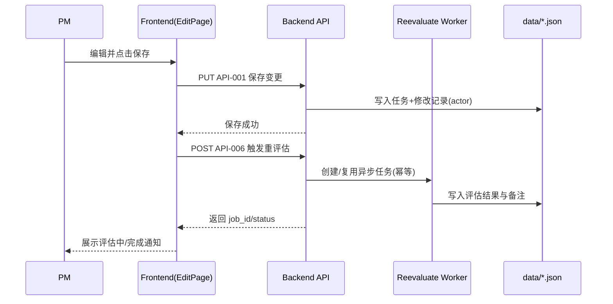

# v2.1 多模块 UI/UX 优化与功能增强 技术方案设计

## 文档信息
| 项 | 值 |
|---|---|
| 状态 | Draft |
| 作者 | AI |
| 评审 | - |
| 日期 | 2026-02-11 |
| 版本号 | `v2.1` |
| 文档版本 | `v0.1` |
| 关联提案 | `docs/v2.1/proposal.md`（v1.8） |
| 关联需求 | `docs/v2.1/requirements.md`（v0.3） |
| 关联主文档 | `docs/技术方案设计.md` |
| 关联接口 | `docs/接口文档.md` |

---

## 0. 摘要（Executive Summary）
- 本次设计聚焦 v2.1 增量改造，目标是以最小破坏方式完成 UI 精简、编辑流程增强、系统画像重构、效能看板升级与系统清单数据源统一。
- 用户可感知变化包括：9 个页面去冗余与布局优化、功能点保存后自动重评估、备注自动生成只读、画像字段由 7 收敛到 4、效能看板新增管理驱动指标。
- 技术路线采用“存量架构增量改造”：前端继续 React + Ant Design，后端继续 FastAPI + JSON 文件存储；通过新增 API-006/API-007 与 Feature Flag 组合，保证可灰度、可回退。
- 关键接口策略：除系统画像字段模型（API-002/API-003）外，其余接口维持向后兼容；保存接口（API-001）与重评估触发（API-006）解耦，解决一次保存多次触发风险。
- 数据策略：沿用 `data/` 目录存储，不新增数据库；系统画像采用“全面升级、不做旧数据自动拼接”，通过部署前快照与回滚 runbook 控制风险。
- 安全与合规重点：权限最小化（admin 新增画像写权限、其他不扩权）、输入校验（`module_structure` JSON 结构约束）、审计增强（`actor_id/actor_role`）、敏感配置不入库。
- 不在本次范围：角色体系重构、评估核心算法重写、新增独立统计页面、旧画像自动迁移。

## 0.5 决策记录（Design 前置收集结果）

> 本次为存量项目增量迭代，技术栈与部署形态沿用 v2.0；仅记录 v2.1 新增/变更决策。

### 技术决策
| 编号 | 决策项 | 用户选择 | 理由/备注 |
|------|--------|---------|----------|
| D-01 | 后端语言/框架 | Python + FastAPI（沿用） | 复用现有服务与接口体系，降低交付风险 |
| D-02 | 前端语言/框架 | React + Ant Design（沿用） | 复用页面与组件，控制 UI 改造成本 |
| D-03 | 数据存储 | JSON 文件（`data/`，沿用） | 符合“无数据库迁移”约束 |
| D-04 | AI 重评估触发 | 保存与重评估解耦（API-006 异步触发） | 避免一次保存多次触发，保障幂等 |
| D-05 | 备注生成策略 | 服务端生成、前端只读 | 统一口径并避免人工覆盖导致数据污染 |
| D-06 | 画像字段模型 | 7 字段收敛为 4 字段 | 对齐提案 D-06/D-11，减少字段冗余 |
| D-07 | 画像迁移策略 | 全面升级，不做旧数据自动拼接 | 自动迁移质量不可控，优先数据正确性 |
| D-08 | 看板能力灰度 | `V21_DASHBOARD_MGMT_ENABLED` 控制 | 新指标支持快速开关回退 |
| D-09 | 系统清单数据源 | 统一到系统清单配置维护数据（`data/`） | 消除 legacy CSV 分叉读取 |

### 环境配置
| 配置项 | 开发环境 | 生产环境 | 敏感 | 备注 |
|--------|---------|---------|------|------|
| `V21_AUTO_REEVAL_ENABLED` | `.env.backend` | `.env.backend` | 否 | 自动重评估开关（默认 true） |
| `V21_AI_REMARK_ENABLED` | `.env.backend` | `.env.backend` | 否 | 备注自动生成/只读开关（默认 true） |
| `V21_DASHBOARD_MGMT_ENABLED` | `.env.backend` | `.env.backend` | 否 | 看板管理指标开关（默认 true） |
| `ALLOWED_ORIGINS` | `.env` | `.env` | 否 | CORS 白名单 |
| `JWT_SECRET` | `.env.backend` | `.env.backend` | 是 | 鉴权密钥（实际值见 `.env`） |
| `DASHSCOPE_API_KEY` | `.env.backend` | `.env.backend` | 是 | LLM/Embedding 密钥（实际值见 `.env`） |
| 系统清单主数据文件 | `data/system_list.csv` | `data/system_list.csv` | 否 | API-005 唯一主系统数据源 |
| 子系统映射文件 | `data/subsystem_list.csv` | `data/subsystem_list.csv` | 否 | API-005 子系统映射数据源 |

## 1. 背景、目标、非目标与约束

### 1.1 背景与问题
- 页面存在大量冗余说明，影响高频操作效率（REQ-001~009）。
- 功能点保存与 AI 重评估边界不清，存在重复触发风险（REQ-010）。
- 备注来源不统一，历史人工编辑与 AI 生成并存导致可追溯性弱（REQ-011）。
- 系统画像 7 字段存在语义重叠，难以稳定注入 AI 上下文（REQ-013）。
- 看板缺少管理驱动指标，无法形成“发现问题→推动改进”的闭环（REQ-015~021）。
- 系统清单读取路径分叉，导致知识导入/信息看板存在空列表风险（REQ-022）。

### 1.2 目标（Goals，可验收）
- G1：完成 9 个页面 UI 精简与布局调整，验收以页面检查项与截图证据为准（REQ-001~009）。
- G2：建立“保存变更→单次重评估→状态反馈→通知恢复”的闭环，确保单次保存最多触发一次重评估（REQ-010, REQ-105, API-006）。
- G3：完成系统画像字段模型 7→4 收敛，并支持 `module_structure` 自动沉淀 + 手工编辑（REQ-013, API-002, API-003）。
- G4：补齐审计字段 `actor_id/actor_role`，确保修改记录可追溯到操作者和角色（REQ-014, API-001）。
- G5：上线管理驱动型看板指标与观测口径，并由开关控制回退（REQ-015~021, REQ-101, API-004, API-007）。
- G6：统一系统清单唯一数据源，消除 legacy CSV 读取链路（REQ-022, API-005）。

### 1.3 非目标（Non-Goals）
- 不改动角色体系（admin/manager/expert/viewer 不变）。
- 不引入数据库或消息队列新基础设施。
- 不重写 AI 评估算法（COSMIC 规则与核心 prompt 模板保持）。
- 不新增独立“效能看板新页面”，仅在既有页面扩展。
- 不执行旧画像数据自动迁移与拼接。

### 1.4 关键约束（Constraints）
- C1：v2.1 为前后端同步发布，画像字段模型变更不提供跨版本兼容窗口。
- C2：除 API-002/API-003 外，其余接口必须保持向后兼容（新增字段需可选且有默认策略）。
- C3：关键行为必须具备回滚手段（Feature Flag 或数据快照恢复）。
- C4：所有敏感配置只落 `.env`，不写入版本文档与仓库。
- C5：部署前必须完成 `data/` 关键文件快照。

### 1.5 关键假设（Assumptions）
| 假设 | 可验证方式 | 失效影响 | 兜底策略 |
|---|---|---|---|
| `activeRole` 切换机制稳定可用 | 前端角色切换回归测试 | 看板视角映射失效 | 默认回退 executive 视角 |
| `ai_initial_features` 快照在 v2.0 已可用 | 抽样检查历史任务数据 | 偏差监控口径不完整 | 标注“口径降级”并用当前 AI 值替代 |
| 系统清单维护数据可作为唯一数据源 | API-005 回归测试 | 知识导入/看板系统列表为空 | 保留空列表兜底并告警 |
| 评估任务异步执行基础能力可复用 | API-006 集成测试 | 重评估状态不可见 | 返回 `skipped` 并提示手动重试 |

## 2. 需求对齐与验收口径（Traceability）

### 2.1 需求-设计追溯矩阵（必须）
| REQ-ID | 需求摘要 | 设计落点（章节/模块/API/表） | 验收方式/证据 |
|---|---|---|---|
| REQ-001 | 系统清单页面布局优化 | §5.10 `SystemListConfigPage.js` | UI 检查清单 + 截图 |
| REQ-002 | 规则管理页面简化 | §5.10 `CosmicConfigPage.js` | UI 检查清单 + 截图 |
| REQ-003 | 效能看板布局与权限优化 | §5.10 `EfficiencyDashboardPage.js` + API-004 | E2E + 接口对账 |
| REQ-004 | 任务管理页面简化 | §5.10 `TaskListPage.js` | UI 检查清单 + 截图 |
| REQ-005 | 功能点编辑页冗余清理 | §5.10 `EditPage.js` | UI 回归 + 截图 |
| REQ-006 | 知识导入页面简化 | §5.10 `SystemProfileImportPage.js` | UI 回归 |
| REQ-007 | 信息看板页面简化 | §5.10 `SystemProfileBoardPage.js` | UI 回归 |
| REQ-008 | 专家评估页布局优化 | §5.10 `EvaluationPage.js` | UI 回归 + 操作路径验证 |
| REQ-009 | 全局冗余文字清理 | §5.10 全局 Layout 文案层 | 全局巡检脚本 + 截图 |
| REQ-010 | 保存后自动重评估 | §5.3 主流程 + API-006 | 接口幂等测试 + E2E |
| REQ-011 | 备注 AI 自动生成只读 | §5.3 失败路径 + API-001/API-006 | 回归测试 + 数据抽样 |
| REQ-012 | 功能点级修改记录复用 | §5.2 `task_modifications` | 历史/新增任务对账 |
| REQ-013 | 画像字段 7→4 收敛 | §5.2 `system_profiles` + API-002/003 | 接口契约测试 |
| REQ-014 | 操作人字段增强 | §5.2 `task_modifications` + API-001 | 字段完整性校验 |
| REQ-015 | 画像完整度排行 + 预警 | §5.4 API-004 + §5.9 指标 | 看板数据核验 |
| REQ-016 | PM 修正率排行 | §5.4 API-004 + §5.9 指标 | 指标口径核验 |
| REQ-017 | AI 命中率排行 | §5.4 API-004 + §5.9 指标 | 阈值算法回归 |
| REQ-018 | 评估周期排行 | §5.4 API-004 + §5.9 指标 | 周期计算对账 |
| REQ-019 | 画像贡献度排行 | §5.2 审计数据 + API-004 | 统计口径核验 |
| REQ-020 | AI 工作量偏差监控 | §5.4 API-004 + §5.9 指标 | 偏差公式对账 |
| REQ-021 | AI 学习趋势 | §5.4 API-004 + §5.9 指标 | 趋势序列核验 |
| REQ-022 | 系统清单数据源统一 | §4.3 影响面 + API-005 | 端到端回归 |
| REQ-101 | Feature Flag 开关机制 | §5.6 配置开关 + API-007 | 开关回退演练 |
| REQ-102 | 数据备份与回滚 | §6.1 Runbook + 回滚策略 | 备份恢复演练 |
| REQ-103 | API 向后兼容 | §5.4 API 契约兼容策略 | 旧调用方回归测试 |
| REQ-104 | 知识命中率观测 | §5.9 指标口径 | 看板/API 查询验证 |
| REQ-105 | AI 评估状态反馈 | §5.3 流程状态机 | 交互时延验证（1s 内反馈） |

### 2.2 质量属性与典型场景（Quality Scenarios）
| Q-ID | 质量属性 | 场景描述 | 目标/阈值 | 验证方式 |
|---|---|---|---|---|
| Q-01 | 可用性 | 重评估执行中重复触发 | 同一 task 同时仅 1 个任务 | API-006 幂等测试 |
| Q-02 | 兼容性 | v2.0 调用方调用 v2.1 API | 非画像接口零改动可调用 | 回归测试 |
| Q-03 | 可观测性 | 看板统计样本不足 | 返回 `N/A/null` 非误导性数据 | 指标边界测试 |
| Q-04 | 安全性 | 非授权角色编辑画像 | 返回 403 + 明确错误码 | 权限测试 |
| Q-05 | 交互体验 | 触发重评估后前端提示 | 1 秒内出现状态提示 | E2E + 录屏证据 |

## 3. 现状分析与方案选型（Options & Trade-offs）

### 3.1 现状与问题定位
- 前端高频页面存在大量解释性文案与重复标识，信息密度过高。
- 保存接口同时承担“持久化 + 触发重评估”会与前端逐字段保存机制冲突。
- 系统画像 7 字段模型与 AI 四类问题（系统范围/模块结构/集成点/约束）映射不直观。
- 系统清单在多处模块仍存在 legacy 路径读取，难以形成单一事实源。

### 3.2 方案候选与对比（至少 2 个）
| 方案 | 核心思路 | 优点 | 缺点/风险 | 成本 | 结论 |
|---|---|---|---|---|---|
| A（推荐） | 存量增量改造：在现有页面/路由上做字段与流程重构 | 变更面可控、上线快、回滚简单 | 需要严格回归避免“旧逻辑残留” | 中 | 采用 |
| B | 新建 v2.1 专用页面与 API，再逐步切换 | 新旧隔离好 | 双轨维护成本高、切换窗口复杂 | 高 | 不采用 |
| C | 先做领域模型重构（服务层拆分）再改 UI/API | 长期架构更优雅 | 超出本迭代范围，风险高 | 高 | 不采用 |

### 3.3 关键技术选型与新增依赖评估
> 本次不新增第三方依赖，全部基于现有工程能力实现。

| 组件/依赖 | 选型 | 理由 | 替代方案 | 维护状态 | 安全评估 | 移除/替换成本 | 风险/备注 |
|---|---|---|---|---|---|---|---|
| Web 框架 | FastAPI（沿用） | 复用现有路由体系 | Flask | 活跃 | 现有基线稳定 | 低 | 保持错误码风格一致 |
| 前端框架 | React + AntD（沿用） | 页面改造成本最低 | Vue | 活跃 | 现有基线稳定 | 低 | 需统一交互规范 |
| 存储 | JSON 文件（`data/`） | 无 DB 迁移，回滚直观 | 引入 DB | 活跃 | 需文件写锁与备份 | 中 | 并发写需谨慎 |
| 异步任务 | 现有后台任务机制 | 支持重评估异步化 | 引入队列系统 | 活跃 | 无新增供应链风险 | 中 | 需幂等约束 |

## 4. 总体设计（High-level Design）

### 4.1 系统上下文与边界
- 前端：页面布局、交互流程、状态反馈、开关感知。
- 后端：接口契约、权限控制、重评估任务编排、数据写入、指标计算。
- 数据层：`data/` 文件存储（任务、画像、修改记录、系统清单等）。

外部依赖清单：

| 依赖方/系统 | 用途 | 协议 | SLA/SLO | 失败模式 | 降级/兜底 | Owner |
|---|---|---|---|---|---|---|
| LLM/Embedding 服务 | 备注生成/评估推理 | HTTP | 内部约定 | 超时/失败 | 返回 `skipped/failed`，允许手动重试 | AI 平台 |
| 系统清单导入文件 | 系统负责人映射 | 文件 | 部署内控 | 文件缺失/空 | 返回空列表 + 告警 | 业务配置管理员 |

### 4.2 架构概述（建议按 C4）

### 4.3 变更影响面（Impact Analysis）
| 影响面 | 是否影响 | 说明 | 需要迁移/兼容 | Owner |
|---|---|---|---|---|
| API 契约 | 是 | API-001~007 调整/新增 | 除画像 API 外向后兼容 | Backend |
| 存储模型 | 是 | `system_profiles` 7→4；`task_modifications` 增加 actor 字段 | 旧画像不自动迁移；保留快照回滚 | Backend |
| 权限与审计 | 是 | admin 新增画像写权限；增强操作人审计 | 权限回归必测 | Backend |
| 性能与容量 | 是 | 新看板指标计算与重评估任务并发 | 增量压测 + 指标观测 | Backend |
| 运维与监控 | 是 | 新增开关、任务状态、指标观测 | 增加告警规则 | DevOps |
| 前端交互 | 是 | 9 页面改造 + 状态反馈 + 开关驱动 UI | 完整 UI 回归 | Frontend |

## 5. 详细设计（Low-level Design）

### 5.1 模块分解与职责（Components）
| 模块 | 职责 | 关键接口 | 关键数据 | 依赖 |
|---|---|---|---|---|
| `frontend/src/pages/EditPage.js` | 功能点编辑、保存后触发重评估、状态反馈 | API-001/API-006/API-007 | 任务编辑态、评估态 | `backend/api/routes.py` |
| `frontend/src/pages/EfficiencyDashboardPage.js` | 看板布局调整与管理指标展示 | API-004/API-007 | 排名/趋势数据 | `backend/api/routes.py` |
| `frontend/src/pages/SystemProfileBoardPage.js` | 画像四字段编辑与展示 | API-002/API-003 | `module_structure` 等字段 | `backend/api/system_profile_routes.py` |
| `backend/api/routes.py` | 任务保存、重评估触发、看板统计 | API-001/API-004/API-006/API-007 | `task_storage.json` | 任务服务/通知服务 |
| `backend/api/system_profile_routes.py` | 画像读写与权限控制 | API-002/API-003 | `system_profiles.json` | 鉴权、存储层 |
| `backend/api/system_routes.py` + `system_list_routes.py` | 系统清单统一数据源 | API-005 | 系统清单存储 | 导入服务 |
| `backend/service/knowledge_service.py` + `backend/agent/system_identification_agent.py` | 系统清单消费与识别 | 内部调用 | 系统列表缓存 | 系统清单数据 |

### 5.2 数据模型与存储（Data Model）
- 画像字段模型（v2.1）：`system_scope`、`module_structure`、`integration_points`、`key_constraints`。
- 修改记录新增：`actor_id`、`actor_role`（缺失时从登录态补齐）。
- 关键文件：`data/task_storage.json`、`data/system_profiles.json`、`data/task_modifications.json`、`data/system_list.csv`、`data/subsystem_list.csv`。

表结构模板（以 JSON 结构等效表示）：

| 表/集合 | 字段 | 类型 | 约束 | 索引 | 说明 |
|---|---|---|---|---|---|
| `system_profiles` | `system_scope` | string | 可空 | system_name | 系统范围描述 |
| `system_profiles` | `module_structure` | array | 元素需含 `module_name/functions` | system_name | 模块→功能清单 |
| `task_modifications` | `actor_id` | string | v2.1 新记录必填 | task_id, ts | 操作人 |
| `task_modifications` | `actor_role` | enum | `admin/manager/expert` | task_id, ts | 操作角色 |

迁移方案（必须写清）：
- 迁移步骤（向后兼容）：
  1. 部署前备份 `data/` 关键文件；
  2. 将 legacy 路径数据迁移到新路径：`system_list.csv` → `data/system_list.csv`，`backend/subsystem_list.csv` → `data/subsystem_list.csv`；
  3. 发布后端（支持 4 字段读写 + actor 审计，且 `system_routes/system_list_routes/knowledge_service/system_identification_agent` 统一读取 `data/` 路径）与前端（4 字段 UI）；
  4. 首次编辑按新模型写入画像，旧 7 字段不再写入。
- 回滚步骤（数据处理策略）：
  1. 关闭 v2.1 新开关；
  2. 回退前后端版本；
  3. 恢复部署前 `data/system_profiles.json` 快照。
- 双写/回填/灰度策略：本次不做双写，不做自动回填。

数据迁移 SOP 检查清单：
- [x] 迁移脚本向后兼容策略已定义（无 schema 脚本，仅应用层处理）
- [x] 回滚恢复路径已定义（快照恢复）
- [x] 不可逆项已标注（旧画像不自动迁移）
- [x] 大表迁移不适用（JSON 文件模式）
- [x] 回填策略已说明（不回填）
- [x] 迁移顺序明确（备份→发布→验证）
- [x] 停机窗口要求低（按发布窗口执行）

### 5.3 核心流程（Flow）
- 主流程：PM 在编辑页保存 → API-001 持久化与写审计 → API-006 单次触发重评估 → 前端显示状态 → 完成后通知恢复操作。
- 关键失败路径（至少 3 个）：
  1. API-006 重复触发：返回已有 `job_id`，不创建新任务；
  2. LLM 失败：评估状态 `failed`，备注走降级或跳过；
  3. `module_structure` 非法：API-002 返回 `invalid_module_structure`；
  4. 权限不足写画像：API-002 返回 `permission_denied`。
- 重试与补偿：
  - 重评估补偿可重入，幂等键为 `task_id + running/pending job`；
  - 备注生成与重评估解耦，避免重复生成。

失败路径清单：

| 场景 | 触发 | 期望行为 | 用户提示/错误码 | 是否可重试 | 兜底 |
|---|---|---|---|---|---|
| 重评估重复触发 | 同一 task 并发调用 API-006 | 复用已有任务 | `200` + 已有 `job_id` | 是 | 前端提示“已在评估中” |
| 画像 JSON 非法 | `module_structure` 结构错误 | 拒绝写入 | `invalid_module_structure` | 是 | 提供格式化模板 |
| 无权限写画像 | 非 admin 且非主责/B 角 | 拒绝写入 | `permission_denied` | 否 | 引导联系主责/admin |
| 外部模型失败 | LLM/Embedding 异常 | 标记失败并可重试 | `failed/skipped` | 是 | 保留手动触发入口 |

### 5.4 API 设计（Contracts）
API 列表：

| API-ID | 方法 | 路径 | 鉴权 | 幂等 | 超时 | 兼容性 | 备注 |
|---|---|---|---|---|---|---|---|
| API-001 | PUT | `/api/v1/requirement/features/{task_id}` | 登录用户 | 否 | 常规 | 向后兼容 | actor 字段可选 |
| API-002 | PUT | `/api/v1/system-profile/{system_name}` | admin/主责PM | 否 | 常规 | 破坏性（7→4） | 新模型写入 |
| API-003 | GET | `/api/v1/system-profile/{system_name}` | 登录用户 | 是 | 常规 | 破坏性（7→4） | 新模型读取 |
| API-004 | POST | `/api/v1/efficiency/dashboard/query` | 登录用户 | 否 | 常规 | 向后兼容（扩展） | 新增管理指标 |
| API-005 | GET | `/api/v1/system/systems` | 登录用户 | 是 | 常规 | 向后兼容 | 统一数据源 |
| API-006 | POST | `/api/v1/tasks/{task_id}/reevaluate` | 登录用户 | 是（task 维度） | 异步 | 新增 | 单次触发重评估 |
| API-007 | GET | `/api/v1/system/config/feature-flags` | 登录用户 | 是 | 常规 | 新增 | 返回 3 个开关 |

接口详细说明（本次关注点）：
- API-001：仅负责保存与修改记录，不直接触发评估；忽略客户端 remark 写入。
- API-002/API-003：字段严格收敛为 4 个，`module_structure` 必须是 JSON array。
- API-004：`perspective` 由前端基于 `activeRole` 自动推导，移除 `ai_involved` 过滤。
- API-006：同一 task 并发幂等，支持 `force`；在 Flag 关闭时返回 `skipped`。
- API-007：前端初始化读取开关，驱动 UI 回退路径。

### 5.5 异步/消息/作业（如适用）
| EVT-ID | Topic/Queue | 生产者 | 消费者 | 投递语义 | 幂等/去重 | DLQ | 备注 |
|---|---|---|---|---|---|---|---|
| EVT-001 | ReevaluateJob（内部任务） | API-006 | 后台评估执行器 | at-least-once | `task_id` 幂等复用 | 无 | 失败可手动重试 |

### 5.6 配置、密钥与开关（Config/Secrets/Flags）
- 配置项：`V21_AUTO_REEVAL_ENABLED`、`V21_AI_REMARK_ENABLED`、`V21_DASHBOARD_MGMT_ENABLED`（默认 `true`）。
- Secret 管理：`JWT_SECRET`、`DASHSCOPE_API_KEY` 保留在 `.env`，禁止进入文档与日志。
- Feature Flag 策略：默认开启；关闭后行为分别回退到 v2.0 路径；上线后两个迭代内评估是否清理。

### 5.7 可靠性与可观测性（Reliability/Observability）
- 重评估链路：API-006 记录 `job_id/status/created_at`，前端轮询或通知更新状态。
- 日志字段：`task_id`、`job_id`、`actor_id`、`actor_role`、`activeRole`、`request_id`。
- 指标：重评估触发次数、幂等命中率、评估失败率、备注生成成功率、看板查询时延。
- 告警：重评估失败率异常（P1）、看板查询超时（P2）、系统清单数据源为空（P1）。

监控清单：

| 指标 | 维度 | 阈值 | 告警级别 | 处理指引 |
|---|---|---|---|---|
| `reeval_failure_rate` | system/task | > 10% | P1 | 检查模型服务与任务执行日志 |
| `dashboard_query_p95` | perspective | > 800ms | P2 | 排查统计聚合与缓存 |
| `system_list_empty_ratio` | env | > 0 | P1 | 校验系统清单存储与导入状态 |

### 5.8 安全设计（Security）
- 认证与授权：沿用 JWT；画像写入权限仅 admin/主责/B 角；默认拒绝未授权修改。
- 输入验证：`module_structure` 进行 JSON 结构与字段约束校验；接口参数枚举值严格校验。
- 数据安全：敏感配置不落盘；日志中不记录密钥；审计字段补齐操作者信息。
- 审计追踪：关键写操作记录 `actor_id/actor_role` 与时间戳，支撑后续追责与统计。

威胁与缓解（STRIDE 简表）：

| 威胁/攻击面 | 风险 | 缓解措施 | 验证方式 |
|---|---|---|---|
| 越权修改系统画像 | 高 | 严格角色+资源校验 | 权限回归测试 |
| 构造非法 JSON 破坏画像结构 | 中 | `module_structure` schema 校验 | API 参数边界测试 |
| 审计缺失导致不可追踪 | 中 | actor 字段强制补齐 | 数据抽样核验 |
| 开关配置误用导致行为异常 | 中 | API-007 可观测 + 发布检查 | 发布前 checklist |

### 5.9 性能与容量（Performance/Capacity）
- 指标口径沿用需求定义：修正率、命中率、偏差率、评估周期、学习趋势等。
- 主要瓶颈：看板多维统计计算 + 重评估任务并发。
- 优化策略：
  - 看板按时间范围与样本量裁剪；
  - 重评估任务按 task 幂等去重；
  - 样本不足返回 `N/A`，避免无意义聚合。
- 压测计划：
  - API-004：按 30 天/90 天窗口分别压测；
  - API-006：并发重复请求验证幂等。

### 5.10 前端设计（有前端界面时必填）

#### 页面结构与路由
| 页面/路由 | 路径 | 布局 | 权限 | 对应 REQ |
|---|---|---|---|---|
| 系统清单配置 | `/config/system-list` | 顶部 Tab | admin | REQ-001 |
| 规则管理 | `/config/cosmic` | 精简头部 + 右下操作区 | admin | REQ-002 |
| 效能看板 | `/dashboard` | 顶部 Tab + 时间筛选 | 全角色（按视角） | REQ-003, REQ-015~021 |
| 任务管理 | `/tasks` | 列表 + 简化详情 | admin/manager/expert | REQ-004 |
| 功能点编辑 | `/tasks/:id/edit` | 双栏编辑 + 状态反馈 | manager | REQ-005, REQ-010, REQ-011 |
| 知识导入 | `/system-profiles/import` | 精简导入工作台 | manager | REQ-006, REQ-022 |
| 信息看板 | `/system-profiles/board` | 画像编辑 + 完整度 | manager/admin | REQ-007, REQ-013 |
| 专家评估 | `/evaluation/:taskId` | 重点信息前置 | expert | REQ-008 |

#### 核心页面说明
- **功能点编辑页（EditPage）**
  - 功能定位：功能点编辑与重评估触发主入口。
  - 主要区块：功能点表单、变更摘要、备注（只读）、操作区。
  - 关键交互：保存成功后自动调用 API-006；评估中按钮置灰并提示；完成后恢复。
  - 数据来源：API-001、API-006、API-007。
- **效能看板页（EfficiencyDashboardPage）**
  - 功能定位：展示管理驱动指标与趋势。
  - 主要区块：顶部 Tab、时间筛选、排名卡片、趋势图。
  - 关键交互：`activeRole` 自动决定 `perspective`；开关关闭时隐藏新增指标。
  - 数据来源：API-004、API-007。
- **信息看板页（SystemProfileBoardPage）**
  - 功能定位：编辑/浏览 4 字段系统画像。
  - 主要区块：字段表单、`module_structure` 编辑区、完整度展示。
  - 关键交互：JSON 校验、格式化、保存失败提示。
  - 数据来源：API-002、API-003。

#### 组件与状态设计
- 共享组件：角色上下文（`activeRole`）、全局通知、统一空状态与错误态组件。
- 状态管理：页面局部状态 + 现有全局用户态；不新增状态管理框架。
- 前后端数据流：页面初始化先拉取 API-007 决定功能开关，再按页面场景调用业务 API。

## 6. 环境与部署（Environments & Deployment）

### 6.0 环境一致性矩阵
| 维度 | DEV | STAGING | PROD |
|------|-----|---------|------|
| 数据 | 开发样本 + 本地文件 | 脱敏副本 | 真实数据 |
| 外部依赖 | 可使用测试模型服务 | 预发模型服务 | 生产模型服务 |
| 配置来源 | `.env` | `.env`/配置中心 | `.env`/配置中心 |
| 密钥管理 | 本地文件（不提交） | 密钥管理系统 | 密钥管理系统 |
| 网络策略 | 宽松 | 接近生产 | 生产策略 |
| 资源规格 | 最小化 | 接近生产 | 生产规格 |
| 监控告警 | 基础日志 | 告警演练 | 正式告警 |

差异风险说明：STAGING 与 PROD 的模型服务质量差异可能影响备注/评估结果，需在验收时补充一轮生产样本回放。

## 6.1 发布、迁移与回滚（Release/Migration/Rollback）

### 6.1.1 向后兼容策略
- API 兼容：API-002/API-003 之外接口保持兼容；新增字段均可选。
- 数据兼容：`task_modifications` 新字段为增量写入；旧记录允许缺失。
- 配置兼容：三个 Flag 默认 true，可单独关闭。

### 6.1.2 上线步骤（Runbook 级别）
1. 备份 `data/` 关键文件（含 `task_storage/system_profiles/task_modifications`）。
2. 发布后端（含 API-006/API-007 与画像 4 字段支持）。
3. 发布前端（页面布局调整与新流程）。
4. 核验 API-007 开关返回与关键页面可访问性。
5. 触发一条重评估任务，确认状态与通知闭环。
6. 抽样核对看板新增指标返回结构与口径。

### 6.1.3 回滚策略（必须可执行）
- 触发条件：重评估任务持续失败、画像读写异常、看板关键接口不可用。
- 回滚步骤：
  1. 关闭 `V21_*` 开关（行为级回退）；
  2. 回退前后端版本；
  3. 恢复 `data/system_profiles.json` 及其他关键快照。
- 数据处理：回滚后对回滚窗口内新增 v2.1 记录做隔离标记，避免统计污染。

## 7. 测试与验收计划（Test Plan）

### 7.1 测试范围
- 单元测试：指标计算函数、`module_structure` 校验、actor 自动补齐。
- 集成测试：API-001~007 契约、权限、幂等、错误码。
- E2E：编辑页保存→重评估→通知；看板角色视角；系统清单统一数据源链路。
- 非功能：Feature Flag 回退演练、备份恢复演练、状态反馈时延验证。

### 7.2 测试用例清单（建议按 REQ-ID）
| TEST-ID | 对应 REQ-ID | 用例说明 | 类型 | 负责人 | 证据 |
|---|---|---|---|---|---|
| TEST-001 | REQ-001~009 | 9 页面 UI 精简与布局检查 | e2e | FE | 截图集 |
| TEST-002 | REQ-010 | 单次保存仅触发一次重评估 | integration | BE | API 调用日志 |
| TEST-003 | REQ-011 | 备注只读 + 生成策略覆盖 | integration | BE | 任务样本对账 |
| TEST-004 | REQ-013 | 画像 4 字段读写契约 | integration | BE | 接口响应样本 |
| TEST-005 | REQ-014 | actor 字段自动补齐 | unit/integration | BE | 修改记录样本 |
| TEST-006 | REQ-015~021 | 看板新增指标口径验证 | integration | BE | 指标对账表 |
| TEST-007 | REQ-022 | 系统清单唯一数据源链路 | integration/e2e | BE/FE | 接口返回 + 页面验证 |
| TEST-008 | REQ-101 | 三个开关独立关闭回退 | e2e | FE/BE | 开关演练记录 |
| TEST-009 | REQ-102 | 备份恢复到 v2.0 可用态 | drill | DevOps | 恢复日志 |
| TEST-010 | REQ-103 | v2.0 调用方兼容回归 | regression | BE | 回归报告 |
| TEST-011 | REQ-104 | 样本不足时知识命中率返回 N/A | integration | BE | 接口样本 |
| TEST-012 | REQ-105 | 1 秒内评估状态反馈 | e2e | FE | 录屏/时序日志 |

### 7.3 验收清单（可勾选）
- [ ] 所有 REQ-ID 均有验证证据
- [ ] 重评估幂等与失败路径覆盖完成
- [ ] 画像字段升级与回滚路径已演练
- [ ] Feature Flag 回退演练完成
- [ ] 看板指标口径与需求表一致

## 8. 风险与开放问题

### 8.1 风险清单
| 风险 | 影响 | 概率 | 应对措施 | Owner |
|---|---|---|---|---|
| 画像 7→4 同步发布窗口异常 | 高 | 中 | 前后端同窗口发布 + 快照回滚 | BE/FE |
| 重评估异步链路抖动 | 中 | 中 | API-006 幂等 + 前端状态兜底 | BE |
| 看板指标样本不足误导决策 | 中 | 中 | 样本量门槛 + N/A 展示 | BE |
| 系统清单源未彻底统一 | 高 | 低 | 对 4 个关键模块做引用清理回归 | BE |
| UI 精简验收主观性偏差 | 低 | 中 | 固化页面检查清单 + 截图基线 | FE |

### 8.2 开放问题（必须收敛）
- [ ] 暂无（Design 阶段已完成决策收敛）。

## 9. 工作拆分与里程碑（Execution Plan）
| 任务ID | 工作项 | 产出/验收 | 依赖 | 负责人 | 预估 |
|---|---|---|---|---|---|
| T001 | 9 页面 UI 精简改造 | UI 检查清单通过 | 无 | FE | 1.5d |
| T002 | API-001 保存逻辑收敛 | 兼容性回归通过 | T001 并行 | BE | 0.5d |
| T003 | API-006 重评估触发落地 | 幂等测试通过 | T002 | BE | 1d |
| T004 | API-007 开关查询接口 | 前端初始化读取成功 | T003 并行 | BE | 0.5d |
| T005 | 画像 4 字段读写改造 | 契约测试通过 | T002 | BE/FE | 1.5d |
| T006 | 看板管理指标扩展 | 指标口径对账通过 | T004 | BE/FE | 1.5d |
| T007 | 系统清单数据源统一 | 关键链路回归通过 | T005 | BE | 1d |
| T008 | 回滚与演练 | 演练记录完成 | T001~T007 | DevOps | 0.5d |

## 10. 变更记录
| 版本 | 日期 | 修改章节 | 说明 | 作者 |
|---|---|---|---|---|
| v0.1 | 2026-02-11 | 初始化 | 基于 requirements v0.3 生成设计初稿，补齐追溯矩阵、架构方案、接口契约、部署回滚与测试计划 | AI |
